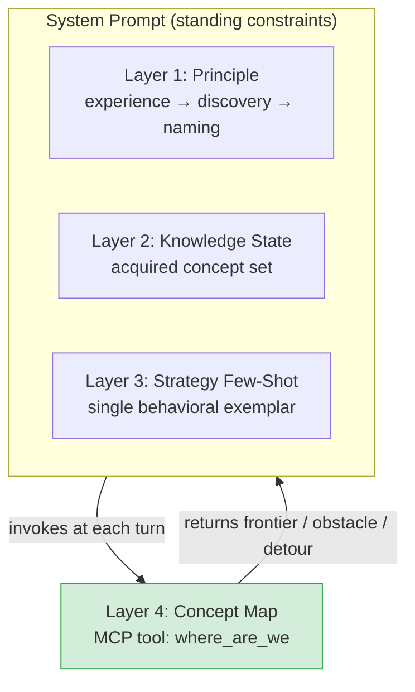
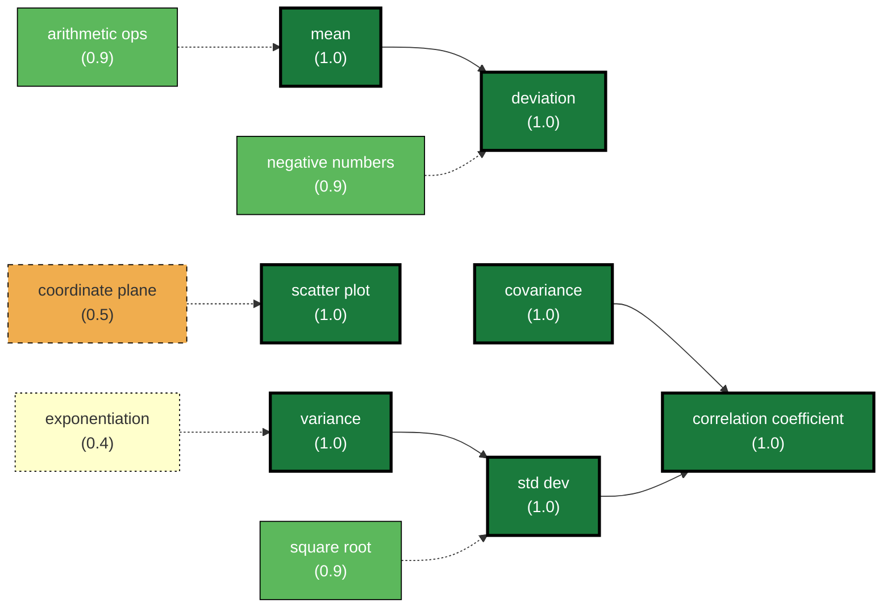
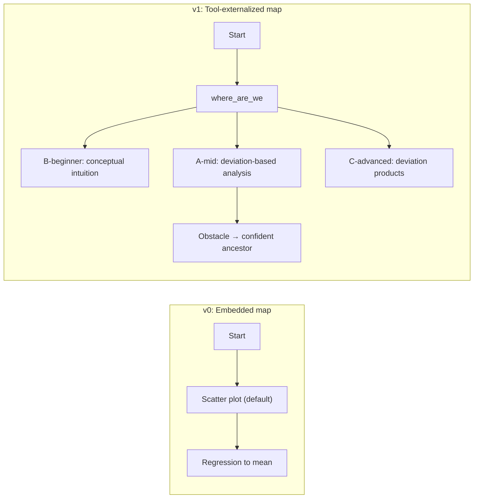
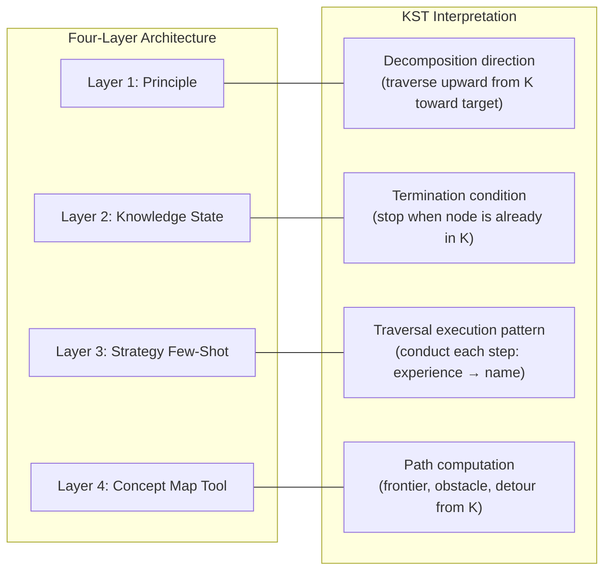

# System-Level Validation of a Four-Layer Control Architecture for LLM Mathematics Tutoring

---

# Abstract
LLM mathematics tutors exhibit a documented failure mode: when a learner signals non-comprehension, models reformulate explanations at the same conceptual depth — *lateral movement* — rather than descending to the learner's existing knowledge. We present a four-layer control architecture that addresses this failure by making the learner's acquired concept set the operational input that determines teaching path selection. The four layers are: (1) a *principle layer* encoding a discovery-first pedagogical sequence drawn from Freudenthal's Guided Reinvention; (2) a *knowledge state layer* representing the learner's acquired concepts as a node subset on a prerequisite graph, in the sense of *Knowledge Space Theory* (KST), a formal framework that models learner knowledge as subsets of a domain's concept set; (3) a *strategy few-shot layer* providing a single transferable behavior-activation rule; and (4) a *concept map layer* externalized as a callable tool rather than embedded in the prompt. We report three experiments. C2 (55 runs) established that the three-layer prompt configuration produces stable discovery-first behavior across algebra, statistics, geometry, and number theory. H1 (475 runs across two model families) demonstrated through ablation that only the acquired-knowledge component affects tutoring paths; struggle indicators and learning-style annotations were ineffective. Galaxy (30 runs plus baseline) showed that externalizing the concept map as a Model Context Protocol (MCP) tool — a JSON-RPC interface that lets the model query the map at decision points rather than reading it from the prompt — causes profile-dependent route selection and obstacle detection (30/30 vs. 5/5 default routes). The contribution is a system-level validation of the control mechanism, not a learning-outcomes evaluation; the reported rates characterize mechanism function, not deployment reliability. Effectiveness measurement is identified as the principal next step.

**Keywords:** AI tutoring, LLM mathematics education, knowledge space theory, guided reinvention, control architecture, concept graph, model context protocol

---

# Section 1: Introduction

## 1. Introduction

Consider a recurring failure mode in mathematics instruction. A learner signals that they do not understand an explanation. The teacher — whether human or AI — tries again: a different metaphor, a rephrased definition, an additional example. The learner still does not understand. The teacher tries again. Nine turns, thirteen turns — the framing shifts, the vocabulary changes, but the level of abstraction remains constant. When resolution eventually arrives, it comes not through another paraphrase but through a descent: the teacher finally opens a box that had been left closed, reveals the concrete situation that motivated the abstract procedure, and connects it to something the learner already knows. The concept clicks. The learner's characteristic response is not relief but a mild frustration: "Why didn't you just explain it that way from the start?"

This pattern — what we term *lateral movement*, the repeated reformulation of an explanation at the same conceptual depth without adjusting the layer of abstraction — is not incidental to AI mathematics tutoring. GuideEval (Liu et al., 2025), a systematic evaluation of instructional guidance across multiple LLM tutors, documented patterns we interpret here as lateral movement: low orchestration-strategy adaptivity, repeated explanation, and weak sensitivity to implicit comprehension signals. No evaluated system showed systematic adjustment of explanatory depth in response to comprehension signals — what we term *vertical movement*.

The underlying cause is not a knowledge deficit. As of 2025, leading large language models achieve perfect scores on the AIME, the most demanding high school mathematics competition in the United States, and gold-medal-level performance at the International Mathematical Olympiad. The mathematical content required for secondary-level instruction is present in these models. The problem is not what LLMs know about mathematics. The problem is the absence of a mechanism that governs *how* they deploy that knowledge for a specific learner.

### The Core Problem: Control, Not Knowledge

When a learner does not understand a concept, the critical question is not "what else can I say about this concept?" but "what does this specific learner already know, and what prerequisite layer is missing?" These are structurally different questions. The first operates on the concept; the second operates on the learner's knowledge state relative to the concept's prerequisite graph. Answering the second question requires three things: a representation of the learner's acquired concepts, a map of the concept's prerequisite structure, and a principle that governs how the tutor should move through that structure in response to comprehension signals.

None of these three elements — learner representation, prerequisite map, pedagogical principle — are provided by default in an LLM tutoring interaction. Without them, the LLM falls back on its statistical defaults: rephrasing, adding examples, adjusting register. The result is lateral movement. The failure is not a model capability failure; it is a control architecture failure.

This paper presents a four-layer control architecture that addresses this failure. The architecture does not attempt to add mathematical knowledge to an LLM — the knowledge is already there. It provides the control layer that governs how that knowledge is deployed for a specific learner: when to descend in abstraction, when to surface a prerequisite concept, when to connect the current concept to something the learner already possesses. The architecture comprises four layers: (1) a *principle layer* encoding a discovery-first pedagogical sequence; (2) a *knowledge state layer* representing the learner's acquired concept set; (3) a *strategy few-shot layer* providing a single transferable teaching-behavior activation pattern; and (4) a *concept map layer* externalized as a callable tool rather than embedded in the prompt.

### Scope of This Paper

This paper presents an **architectural proof-of-concept**: we document a four-layer control system that demonstrably governs LLM teaching behavior along the three dimensions it was designed to address — pedagogical sequencing, learner-specific route selection, and prerequisite-structure consultation. Evaluation of whether this governed behavior improves human learner outcomes is outside the present scope; it is identified as the first priority of future work (Section 6.4). The contribution of this paper is therefore a **system-level validation** of the control mechanism, not a learning-outcomes evaluation of the pedagogical approach. Deployment into a learner-facing system and the subsequent effectiveness evaluation proceed on a separate track and are reported elsewhere.

### Three Contributions

This paper makes three contributions.

First, we present the design of the four-layer control architecture. Each layer is interpreted through a body of theory used here as a retrospective framework for design decisions arrived at experimentally: the principle layer aligns with Freudenthal's (1991) Guided Reinvention and the anti-didactic inversion; the knowledge state layer and concept map layer correspond to constructs in Knowledge Space Theory (Doignon & Falmagne, 1999); and the strategy few-shot layer reflects the empirical finding that a single well-chosen exemplar transfers across mathematical domains.

Second, we report three experiments that validate the architecture. Experiment 1 (C2, 55 runs) established that the three-layer configuration — principle, knowledge state, and strategy few-shot, without the concept map — produces stable discovery-first teaching behavior across topics including algebra, statistics, geometry, and number theory. Experiment 2 (H1, 475 runs across Gemini and Claude) demonstrated through ablation that only the acquired-knowledge component of the learner profile affects tutoring paths; struggle indicators and learning style descriptors had no detectable effect, a finding that is model-independent and directly informs the knowledge state layer's design. Experiment 3 (Galaxy, 30 runs plus a 5-run baseline) showed that externalizing the concept map as a Model Context Protocol (MCP) tool — rather than embedding it in the prompt — causes the tutor to select profile-dependent teaching routes with obstacle detection. Full result details appear in Sections 4 and 5.

Third, we connect the learner profile to a formal theoretical construct: the knowledge state in Knowledge Space Theory (KST). A KST knowledge state is a subset of concepts that a learner has acquired on a prerequisite graph — precisely the structure represented by the knowledge state layer. This correspondence was identified after the architecture had been validated on experimental grounds; KST then provides a formal vocabulary characterizing which knowledge states are reachable (antichain-closed subsets), what frontier concepts are accessible from a given state, and what detour routes become available when a concept proves inaccessible (see Section 6.1 for the retrospective nature of this mapping). The architecture translates these formal properties into operational tutoring behaviors.



**Figure 1.** Four-layer control architecture. Layers 1–3 embed in the system prompt as standing constraints. Layer 4 is invoked as an external tool at each conversational turn. Section 3 details each layer.

### Paper Organization

Section 2 reviews the theoretical foundations (Freudenthal's Guided Reinvention, Knowledge Space Theory) and related work, characterizing the gap that the architecture addresses. Section 3 presents the four-layer architecture. Section 4 describes the three experiments and their methods. Section 5 reports the results. Section 6 discusses theoretical implications, limitations, and future directions. Section 7 concludes.

---

# Section 2: Background and Related Work

## 2. Background and Related Work

The four-layer control architecture rests on two theoretical traditions — Freudenthal's Guided Reinvention and Knowledge Space Theory — and is motivated by empirical work documenting the specific failures it was designed to address.

---

### 2.1 Theoretical Foundations

#### Freudenthal's Guided Reinvention and the Anti-Didactic Inversion

Hans Freudenthal's Realistic Mathematics Education (RME; Freudenthal, 1991) is the pedagogical tradition with which the architecture's principle layer aligns; the alignment was identified retrospectively, as a framework for interpreting design decisions arrived at experimentally (see Section 6.1). Freudenthal's central diagnostic observation is that conventional instruction reverses the epistemic order in which mathematical concepts are most naturally understood: schools begin with the finished, formalized product — the name, the definition, the algorithm — rather than with the concrete situation from which it emerged. Freudenthal called this reversal the *anti-didactic inversion*.

The corrective principle, *Guided Reinvention*, runs in the opposite direction. Instruction begins with a concrete situation that motivates the learner to act without being told what to do; through engagement with it, the concept's structure becomes visible; the formal name arrives last, as a label for something the learner has already constructed. Guided Reinvention is not unstructured discovery: the teacher designs an environment in which the learner's activity naturally converges toward the target concept. Gravemeijer (1994) formalized this as *didactical phenomenology*; Bruner (1966) established the enactive → iconic → symbolic progression as a general pedagogical principle; Toeplitz (1963) proposed that concepts should be introduced through the "burning questions" that made them historically necessary.

The principle layer of the four-layer architecture operationalizes these traditions as a single sequence: experience the phenomenon before naming it, elicit the learner's discovery of the underlying structure, and connect that structure to something already known before assigning a formal label. What these traditions do not provide is the mechanism for *adapting* this sequence to a specific learner's existing knowledge state — that is the contribution of the remaining three layers.

#### Knowledge Space Theory

Knowledge Space Theory (KST; Doignon & Falmagne, 1999) provides the formal vocabulary used in this paper to interpret the knowledge state layer and concept map layer; the mapping is retrospective rather than foundational (Section 6.1). KST formalizes a learner's knowledge as a subset $K$ of a concept domain $Q$ closed under the prerequisite relation: if a learner has acquired concept $c$, they must also have acquired all concepts $c$ depends on. The set of all coherent subsets forms the *knowledge space*.

Two KST constructs map directly onto the architecture's layers. The *frontier* of $K$ is the set of concepts not yet in $K$ whose prerequisites are all in $K$ — the concepts immediately accessible from the learner's current state. The *fringe* extends this to partial prerequisite satisfaction. These constructs formalize which concepts can be taught next and which require prerequisite work first.

ALEKS (Falmagne et al., 2006) is the most prominent prior KST application in educational technology, using knowledge space inference to sequence practice items. The present work differs in two respects: ALEKS applies KST to procedural practice sequencing, whereas this paper applies it to *teaching route selection* through a prerequisite graph; and ALEKS treats the knowledge space as a fixed, manually curated structure, whereas this paper constructs the prerequisite graph via LLM-based multi-model union (Section 3.6).

---

### 2.2 Related Work

#### LLM Tutoring: Control and Its Absence

Bastani et al. (2025) reported a randomized controlled trial of GPT-4 tutoring in Turkish high schools. Students with unrestricted access showed 48–127% improvement on practice assessments but a 17% decline on independent tests — consistent with dependency formation. A hint-only "GPT Tutor" variant reduced but did not eliminate this harm. Bastani et al. thus established that control is necessary and that a behavioral constraint alone is insufficient: what is needed is a mechanism for governing the tutor's pedagogical approach in response to the learner's knowledge state. The four-layer architecture addresses this directly.

MathTutorBench (Macina et al., 2025) corroborates this from a benchmark direction: mathematical subject-matter expertise does not predict tutoring quality, characterizing the gap between what LLMs know and how they teach.

#### LLM Tutoring Quality Evaluation

GuideEval (Liu et al., 2025) systematically evaluated instructional guidance across multiple LLM tutors and found that models respond effectively to explicit expressions of confusion but fail to detect implicit comprehension signals; they exhibit repeated explanation and topic-shift rather than adjusting conceptual depth; and orchestration strategy adaptivity — adjusting pedagogical approach based on learner state — is a consistent weakness. No evidence of systematic vertical movement (descending to lower abstraction levels) was found in any evaluated model.

These findings — interpreted in this paper as the lateral-movement pattern — establish a general property of current LLM tutoring behavior and provide the empirical motivation for the architecture's principle layer: without a mechanism that explicitly governs when and how to descend in abstraction, LLMs default to lateral reformulation. The terms *lateral movement* and *vertical movement* are this paper's framing; the empirical findings themselves are reported by GuideEval in its own vocabulary.

#### Concept Graph Construction

MAS-KCL (Jiang et al., 2025) demonstrated that a multi-agent LLM workflow can learn knowledge component graph structures, evaluated on MOOCCubeX-Math via loss against baseline structure-learning algorithms, establishing the feasibility of LLM-based prerequisite graph construction at scale. Yang et al. (2025) evaluated LLM performance on concept generation, concept extraction, and prerequisite relation identification across multiple GPT models, finding that GPT-4o produces concepts that are educationally meaningful despite lexical divergence from ground-truth labels — relevant to evaluating construction quality when ground truth is noisy.

The concept graph construction methodology used in this paper (Section 3.6) extends these approaches via multi-model union and is validated against an external benchmark. De Paiva and Moss (2023) provide an earlier reference point, establishing that ChatGPT-scale models can extract domain concepts from mathematical literature.

#### Adaptive Learning Systems (Non-LLM)

MathAcademy (Skycak et al., Math Academy LLC) is the most commercially mature implementation of prerequisite-graph-controlled adaptive mathematics learning. Its manually constructed knowledge graph of approximately 2,500 topics and proprietary FIRe (Fractional Implicit Repetition) algorithm use credit propagation: practice on a higher-order topic implicitly reinforces prerequisite topics through a deterministic trickle-down model. The algorithm and graph construction are described in Skycak and Roberts (2023); as of this writing, neither has appeared in peer-reviewed publication.

The present work differs from MathAcademy along three axes: (1) *control mechanism* — MathAcademy directly determines the next curriculum item; the four-layer architecture governs an LLM's route selection, leaving content generation to the model; (2) *learning model* — procedural mastery through accumulated correct repetitions vs. conceptual acquisition as a KST knowledge state; (3) *graph source* — manually authored vs. automatically constructed via LLM-based multi-model union.

#### Mathematical Benchmarks and Scope Boundaries

MathNet (Alshammari et al., 2026) and MathTutorBench (Macina et al., 2025) operate on the axis of model capability and pedagogical quality evaluation. The present work targets the control axis: given a model with sufficient capability, how is its teaching route selected for a specific learner. The two axes are complementary.

#### Knowledge Tracing

The knowledge tracing literature — from Bayesian Knowledge Tracing (Corbett & Anderson, 1994) through deep knowledge tracing (Piech et al., 2015) and LLM-augmented variants (Li et al., 2026) — is relevant as prior art on learner state representation but differs from the knowledge state layer in two respects. Knowledge tracing targets *procedural skill mastery* — whether the learner can execute a procedure correctly. The knowledge state layer targets *conceptual acquisition* — which concepts the learner has reconstructed and internalized. Additionally, knowledge tracing is retrospective, estimating what the learner knows from past performance; the knowledge state here is populated through qualitative tutor observation, making it prospective.

#### Socratic Tutoring Systems

SocraticLM (Liu et al., 2024) demonstrated that an LLM tutor trained on Socratic questioning outperformed standard GPT-4 on mathematics tutoring benchmarks. Khanmigo implements the same principle at product scale.

The present paper distinguishes between Socratic questioning and Guided Reinvention as design paradigms. Socratic questioning begins with a pre-specified correct answer and engineers a questioning sequence toward it. Guided Reinvention begins with a concrete situation and designs a sequence of experiences leading the learner to reconstruct the concept's motivation and structure before its formal name. The difference is operational: Socratic questioning produces correct-answer elicitation; Guided Reinvention produces concept reconstruction. The architecture's principle layer encodes the latter, which places different demands on the knowledge state and concept map layers.

#### RME Digital Environments

WisWeb and the Digital Mathematics Environment, both grounded in RME (van den Heuvel-Panhuizen & Drijvers, 2014), are the closest design ancestors in terms of pedagogical philosophy. Both implement RME principles including Guided Reinvention. Their documented limitation is that they remain teacher-dependent: the digital environment supplies materials, but the dynamic guidance — when to descend in abstraction, which prerequisite to surface, when the learner has genuinely grasped a concept — is performed by a human teacher. The four-layer architecture addresses this automation gap through knowledge state and concept map representations that enable automated, profile-dependent route selection.

---

### 2.3 The Gap

A precise formulation of the gap: *no existing system governs an LLM's teaching route through a concept's prerequisite graph based on a formal representation of the learner's acquired knowledge state.*

Four prior lines of work each approach this gap without closing it.

Bastani et al. (2025) established that control is necessary, but the GPT Tutor variant provides only a behavioral constraint (hint-only) rather than a route-selection mechanism based on learner state.

SocraticLM (Liu et al., 2024) and Khanmigo provide adaptive questioning sequences oriented toward correct-answer elicitation; neither represents the learner's acquired concept set or queries a prerequisite graph to determine which concepts are accessible from the current knowledge state.

MAS-KCL (Jiang et al., 2025) constructs prerequisite graphs and uses them for learning-path recognition, but does not connect the graph to a tutoring control layer or use it to select a teaching route based on individual learner state.

GuideEval (Liu et al., 2025) documented the behavioral patterns the present paper frames as lateral movement — exactly the failure a route-selecting control layer should prevent — but provides no mechanism for closing it.

The gap is not one of any single missing component. The components — pedagogical sequencing (Freudenthal), learner state formalism (KST), concept graph construction (MAS-KCL, Yang et al.), adaptive LLM tutoring (SocraticLM), prerequisite-graph-controlled curriculum (MathAcademy) — exist in the literature and commercial practice as separate contributions. What does not exist is their integration into a control architecture that connects a formal learner knowledge state to a prerequisite graph, queries that graph to compute the accessible frontier, and selects a teaching route based on the learner's specific knowledge state. That integration is what the four-layer architecture provides, and its empirical validation is the subject of Sections 4 and 5.

---

# Section 3: The Four-Layer Control Architecture

## 3.1 Architecture Overview

Four layers govern how an LLM tutor teaches mathematics — not what it knows, but how it deploys that knowledge for a specific learner. Layers 1–3 are embedded in the system prompt as standing constraints; Layer 4 is externalized as an invocable tool. This split is empirically motivated.

1. **Principle Layer** — Encodes the pedagogical sequence constraint (experience → discovery → naming). Specifies the *order* of instruction.
2. **Knowledge State Layer** — Represents the learner's acquired concept set as a KST knowledge state. Specifies the *starting point* for instruction.
3. **Strategy Few-Shot Layer** — A single behavioral exemplar that activates the target teaching pattern. *Triggers* the teaching style without enumerating rules.
4. **Concept Map Layer** — The prerequisite graph for the target domain, provided as an external MCP tool (`where_are_we`). Supplies *route calculation* infrastructure.

The architecture is shown schematically in Figure 1 (Section 1). Layers 1–3 were established by the C2 experiment (Section 4.1); Layer 4 was identified as necessary by the Galaxy experiment (Section 4.3), which showed that without a map tool the tutor defaults to a fixed route regardless of knowledge state.

---

## 3.2 Layer 1: The Principle Layer

The principle layer encodes four pedagogical constraints derived from Freudenthal's (1991) Guided Reinvention framework, which holds that instruction must follow the order of discovery rather than the order of formal presentation — what Freudenthal termed the *anti-didactic inversion*.

**Anti-Didactic Inversion Reversal.** Instruction follows: concrete situation → natural operation → structural discovery → connection to known methods → name last. Terminology is introduced only after the learner has independently performed the essential operation — mapping onto Bruner's (1966) enactive → iconic → symbolic sequence.

**Six-Variable Discovery Template.** A completeness check for any instructional unit: (1) surface problem, (2) true situation, (3) natural operation, (4) hidden structure, (5) connection to known methods, (6) name last. A unit is complete only when all six are grounded in the learner's existing knowledge. Validation across four topics showed coverage from ~60% (variance) to 95% (Euclidean algorithm).

**Black Box Zero.** Every assertion must be recursively openable to any depth. As of 2025, leading LLMs have achieved perfect AIME scores and gold-medal-level IMO performance (35/42), placing their explanatory accuracy at or above a human secondary-mathematics teacher.

**Vertical Movement.** On two consecutive comprehension failures, the tutor descends one abstraction level rather than producing an alternative representation at the same level. LLM tutors default to lateral movement — representational changes without depth change. GuideEval (Liu et al., 2025) confirmed low orchestration-strategy adaptivity across all evaluated models; this principle overrides that default.

Together, the four principles express a single operation — Building-Blocks decomposition — in which an unknown concept is recursively reduced to components in the learner's acquired knowledge. The principle layer occupies ~40 of the total ~80 prompt lines, encoding the constraint through direct statement and the strategy few-shot (Section 3.4).

*Layer 1 complements Layer 3: Layer 1 specifies what pedagogical structure to produce; Layer 3 activates it by demonstration.*

---

## 3.3 Layer 2: The Knowledge State Layer

The knowledge state layer represents the learner's acquired concept set as the tutor's primary routing input — a *knowledge state* in KST terms (Doignon & Falmagne, 1999): a subset of the concept domain closed under the prerequisite relation. In practice, it is a plain-language list injected at session start:

> Acquired concepts: four arithmetic operations, negative numbers, mean, deviation, variables, coordinate plane, exponentiation, square root.

The decision to populate the knowledge state with the acquired-concept set K *alone* was validated by the H1 ablation study (Section 4.2), which compared three candidate components across 475 runs (400 Gemini, 75 Claude):

- **K** — acquired knowledge; **S** — struggle history; **L** — learning style

Only K produced a measurable change in teaching behavior. Removing K while retaining S and L yielded output indistinguishable from a knowledge-state-free baseline. S and L were ineffective as bare prompt information and as information accompanied by dedicated few-shot exemplars. In KST terms, K determines the *reachable frontier* — the concepts one prerequisite step ahead of confirmed knowledge; S and L have no graph-structural analog.

The current implementation requires manual initialization; automatic estimation from conversational signals is future work (Section 6.2).

*Layer 2 complements Layer 4: the Knowledge State specifies the learner's position within the concept graph; Layer 4 computes routing from that position.*

---

## 3.4 Layer 3: The Strategy Few-Shot

The strategy few-shot layer specifies the target teaching pattern as a concise pedagogical-pattern rule. The term *few-shot* is retained because the pattern was arrived at through demonstrative exemplars, but in the final C2 implementation it is an abstract rule rather than a full tutor–learner dialogue. The layer functions as a behavioral *activation pattern*, not a procedural manual. The complete system prompt used in the experiments — including the principle layer text and the strategy rule — is reproduced in Appendix B.

Early formulations (Experiment 6, Section 4.1) used a concrete exchange from factoring instruction; in the final configuration this is compressed to:

1. Identify what the learner already knows.
2. Connect that knowledge to the target concept via the prerequisite structure encoded in the model's internal representation.
3. Engage the known knowledge first (experience), let the learner observe the emerging pattern (discovery), and name the result last (formalization).

**Domain transfer.** A single rule — formulated from one domain — transferred to algebra, statistics, geometry, and number theory without modification. It operates at the level of pedagogical structure, not domain content.

**Quality over quantity.** Adding a second pattern produced marginally lower compliance than the single-pattern baseline. The architecture uses exactly one specification.

**Model threshold.** Stable activation requires frontier-tier models (Gemini Pro equivalent and above). Smaller models show lower adherence. The architecture is not model-agnostic.

*Layer 3 complements Layer 1: Layer 1 specifies what pedagogical structure to produce; Layer 3 activates it by executable abstract pattern.*

---

## 3.5 Layer 4: The Concept Map as an External Tool

The concept map is provided as an external MCP tool rather than embedded in the system prompt. This is the central architectural finding of the Galaxy experiment (Section 4.3): embedding causes the model to ignore the map; externalization causes active consultation.

**The `where_are_we` tool.** The tool accepts a natural-language observation from the tutor and returns a structured navigation report classifying each concept node as *confident*, *fuzzy*, or *unknown*, then computing:

- **Frontier** — concepts immediately reachable from the learner's current position.
- **Obstacles** — nominally acquired nodes flagged as fuzzy — potential prerequisite instability.
- **Detour** — if an obstacle is detected, a path back to a confident node for re-experience.

A *surveyor* sub-agent converts the tutor's observation into node-level status estimates; a deterministic graph step produces frontier, obstacle, and detour outputs. The full tool schema, surveyor configuration, and graph algorithms are documented in Appendix C.

**Embedding vs. tool.** In Galaxy v0, the map was embedded as JSON in the system prompt. All five runs ignored it and followed the same default route. In v1, provided as `where_are_we`, the tutor called the tool at each turn and produced profile-dependent paths across all three profiles (15/15). Replication on factorization confirmed generalization (9/9 profile-dependent routes, 3/3 obstacle detections). The mechanism reflects a general property: embedded text may be bypassed; tool invocation creates an explicit retrieval event the model incorporates.

**Modularity.** Switching domains required only changing the graph data file in the MCP server; Layers 1–3 were unchanged.

*Layer 4 complements Layer 2: the Knowledge State specifies the learner's position; Layer 4 computes routing from it.*

---

## 3.6 Concept Graph Construction

The prerequisite graph supplied to `where_are_we` is constructed automatically via a multi-model union procedure. The target concept is submitted to five to ten independent LLM instances (combining Claude and Gemini models). Each enumerates prerequisite concepts and directed prerequisite relationships. Outputs are normalized through name canonicalization and merged into a union graph; each node and edge receives a *confidence score* equal to the fraction of models that independently generated it:

- **Core** (confidence ≥ 0.7) — consistent across models and prompting strategies; used for routine frontier calculations.
- **Fringe** (confidence ≤ 0.4) — model-specific judgments; available for diagnostic queries but not routine routing.

**Validation at two scales.** Table 1 summarizes validation at single-domain depth and across secondary mathematics breadth.

| Validation | Scale | Graph size | Key result |
|---|---|---|---|
| Single-domain (correlation coefficient) | 1 domain | 36 nodes, 61 edges | 96% precision vs. MOOCCubeX benchmark |
| Breadth (secondary mathematics) | 60 units | 435 concepts, 1,093 edges | computeTerrain returned non-empty frontier sets across all 180 tested knowledge-state scenarios; fog values decreased monotonically as knowledge state approached full acquisition |

**Table 1.** Concept graph construction validated at two complementary scales. Pedagogical correctness of induced routes is evaluated separately in Section 4.3.


The 4% of cases not matching MOOCCubeX consist primarily of relationships present in the LLM-generated graph but absent from the benchmark — the majority genuine prerequisite relationships not annotated in the benchmark.

**Core structure for the correlation coefficient domain.** Table 2 lists the maximum-confidence (1.0) nodes and edges across all ten runs.

| Element | Type | Confidence |
|---|---|---|
| mean, deviation, variance, standard deviation, covariance, scatter plot, correlation coefficient | nodes (7) | 1.0 |
| mean → deviation | edge | 1.0 |
| variance → standard deviation | edge | 1.0 |
| covariance → correlation coefficient | edge | 1.0 |
| standard deviation → correlation coefficient | edge | 1.0 |

**Table 2.** Maximum-confidence nodes and edges in the correlation coefficient concept graph.



**Figure 2.** Concept graph for the correlation coefficient domain. Confidence tier is encoded redundantly by both fill color and border style: core (1.0) in dark green with thick solid border; medium-high (0.9) in light green with thin solid border; mid-band (0.5) in amber with dashed border; fringe (0.4) in pale yellow with dotted border. Core edges (confidence ≥ 0.7) are solid; fringe edges are dashed.

The multi-model union captures domain-level consensus; learner-level variation is handled by Layer 2, which specifies which nodes the specific learner has acquired.

---

## Summary

Layer 1 (Principle) constrains instruction order through four pedagogical principles grounded in Freudenthal's Guided Reinvention framework. Layer 2 (Knowledge State) provides the learner's starting position as an acquired concept set — empirically validated by ablation as the operative component of the learner model. Layer 3 (Strategy Few-Shot) activates target teaching behavior through a single transferable abstract rule. Layer 4 (Concept Map Tool) provides route selection and obstacle detection, externalized as a tool to ensure active consultation.

Each design decision emerged from experimental evidence. The following section describes those experiments.

---

## References (Section 3)

- Bruner, J. S. (1966). *Toward a Theory of Instruction*. Harvard University Press.
- Doignon, J.-P., & Falmagne, J.-C. (1999). *Knowledge Spaces*. Springer.
- Freudenthal, H. (1991). *Revisiting Mathematics Education: China Lectures*. Kluwer Academic Publishers.
- Liu, et al. (2025). GuideEval: Evaluating the instructional guidance capabilities of LLM tutors.

---

# Section 4: Experiments
Three experiments validate the four-layer control architecture: C2 (control layer stability), H1 (knowledge state ablation), and Galaxy (concept map delivery).

---

## 4.0 Experimental Program Overview

The experimental program ran from February to April 2026. Experiment 1 (C2) comprised eleven sub-experiments covering iterative prompt design and a formal stability evaluation. Experiment 2 (H1) produced 475 classified tutor responses across two model families under five knowledge-state ablation conditions. Experiment 3 (Galaxy) produced 35 runs across two concept domains and three learner profiles. Concept-graph construction was validated at two scales: a single-domain benchmark comparison against MOOCCubeX (96% precision) and a structural validation across 60 units, 435 concepts, and 1,093 prerequisite edges. All experimental artifacts are maintained in the project repository.

**Table 3. Model versions used across experiments.**

| Experiment | Phase / Sub-experiment | Model | Version | Date Range |
|---|---|---|---|---|
| C2 (§4.1) | Sub-exp 1–4 (baseline exploration) | Gemini Flash | gemini-2.5-flash | 2026-02 |
| C2 (§4.1) | Sub-exp 10 (model comparison) | Gemini Flash | gemini-2.5-flash | 2026-02–03 |
| C2 (§4.1) | Sub-exp 10 (model comparison) | Gemini Pro | gemini-3.1-pro-preview | 2026-02–03 |
| C2 (§4.1) | Sub-exp 10 (model comparison) | Claude Opus | Claude Opus 4.6 | 2026-02–03 |
| C2 (§4.1) | Sub-exp 5–8, 11a–c (few-shot formulation) | Claude Opus | Claude Opus 4.6 | 2026-02–03 |
| C2 (§4.1) | Sub-exp 9, 11d–e (formal stability evaluation) | Gemini Pro | gemini-2.5-pro | 2026-03 |
| H1 (§4.2) | Phase 1 — Gemini ablation (400 responses) | Gemini Pro | gemini-3.1-pro-preview (thinking disabled) | 2026-03 |
| H1 (§4.2) | Phase 2 — Claude cross-model replication (30 responses) | Claude Opus | Claude Opus 4.6 | 2026-03 |
| H1 (§4.2) | Phase 3 — S/L few-shot experiment (25 responses) | Claude Opus | Claude Opus 4.6 | 2026-03 |
| Galaxy (§4.3) | v0 baseline + v1 correlation + v1 factoring (35 runs) | Claude Opus | Claude Opus 4.6 | 2026-03-15 |

*Note: "gemini-3.1-pro-preview" refers to the model identifier used at the time of the experiments (February–March 2026). Version identifiers may not correspond to currently available model names.*

---

## 4.1 Experiment 1: Control Layer Stability (C2)

Experiment 1 establishes that the three-layer prompt configuration (principle, knowledge state, strategy few-shot) produces stable discovery-first teaching behavior across mathematical domains, and that this behavior fails to emerge under instruction-enumeration prompting.

### 4.1.1 Baseline: Failure of Vanilla Prompting

Conditions C0 and C1 enumerated behavioral instructions with increasing detail. Human-in-the-loop review across four probes yielded a P5 judgment — the lowest quality rating in the five-point rubric — confirming that instruction enumeration does not produce discovery-first behavior and motivating the three-layer architecture.

### 4.1.2 Experimental Design

**Structure.** The experiment comprised eleven sub-experiments. The formal stability evaluation used two complementary designs:

- **Single-probe stability (Sub-experiment 11d):** C2 prompt with Gemini 2.5 Pro, five runs at temperature=0 on probe P6.
- **Broader stability ablation (Sub-experiment 11e):** Full condition (principle + knowledge state + strategy few-shot) versus None condition (knowledge state removed), across four probes (P6, P5, P-stat, P-geom) with five replicates per probe per condition, producing 40 classified responses.

**Table 4. Learner Probes**

| ID | Domain | Dialogue Depth | Description |
|----|--------|---------------|-------------|
| P6 | Algebra | Turn 1 | Factor theorem problem with attached textbook image |
| P5 | Algebra | Turn 13 | Parity: "I still don't get why it's even" |
| P3 | Algebra | Turn 19 | Prerequisite exploration: "Where does the 2x come from?" |
| P-stat | Statistics | Turn 1 | "What's correlation coefficient? Show me the formula" |
| P-geom | Geometry | Turn 1 | Congruence proof setup |

**Sub-experiment summary.** Table 5 summarizes all eleven sub-experiments.

**Table 5. C2 Sub-Experiment Overview**

| ID | Research Question | N | Probe(s) | Outcome |
|----|-------------------|---|----------|---------|
| 1–3 | C0/C1 baseline quality | — | P5 | P5 HIL rating — confirms baseline failure |
| 4–6 | Principle layer only (v1–v3 prompt) | — | P5 | Principle alone insufficient without few-shot |
| 7 | Statistics transfer (P-stat) | 1 | P-stat | Domain transfer confirmed |
| 8 | Geometry transfer (P-geom) | 1 | P-geom | Domain transfer confirmed |
| 9 | Number theory transfer | 1 | Parity | Transfer confirmed |
| 10 | Model comparison (Flash / Pro / Claude) | 3 | P6 | Model threshold identified |
| 11a | Multi-turn stability (3-turn P5 simulation) | 3 | P5 | Experience → discovery → naming maintained |
| 11b–c | Knowledge state removal ablation (preliminary) | 10 | P6, P5 | Knowledge state drives path change |
| 11d | Single-probe stability (temperature=0 × 5) | 5 | P6 | 5/5 consistent discovery-first first move |
| 11e | Full vs. None × 4 probes × 5 replicates | 40 | P6, P5, P-stat, P-geom | Full: 11/20 Experience; None: 8/20 (aggregate) |

**Controls and classification.** We enforced temperature=0, Fisher-Yates shuffle of few-shot component order, and exponential backoff retry logic. We classified each response by the first substantive tutor move: *Experience* (calculation, diagram, or substitution request), *Confirmation* (probing existing knowledge), or *Explanation* (passive concept presentation). Inter-rater agreement was κ=0.831; the full P1–P5 HIL quality rubric, the three-category response classifier, the labeling procedure, and the 65-item re-classification log are documented in Appendix D. A post-hoc re-classification of the same 65 items changed 22 labels (34%), revising the Full condition experience rate from 95% to 55%.

**Model comparison and domain transfer.** Sub-experiment 10 crossed three models (Gemini 2.5 Flash, Gemini 2.5 Pro, Claude Opus 4.6) with three prompt conditions (principle only, principle + knowledge state, full); results are reported in Section 5.1.1 (Table 9). The algebra few-shot applied without modification to P-stat and P-geom produced discovery-first behavior in both domains (Section 5.1).

---

## 4.2 Experiment 2: Knowledge State Ablation (H1)

Experiment 2 isolates which component of the learner model drives the teaching-path change: acquired knowledge (K), struggle history (S), or learning style (L).

### 4.2.1 Experimental Design

Five ablation conditions were constructed for a single learner profile (a secondary-school student learning correlation coefficient).

**Table 7. H1 Ablation Conditions**

| Condition | K (acquired knowledge) | S (struggle history) | L (learning style) |
|-----------|:---------------------:|:-------------------:|:-----------------:|
| Full | ✓ | ✓ | ✓ |
| K-only | ✓ | — | — |
| S-only | — | ✓ | — |
| L-only | — | — | ✓ |
| None | — | — | — |

**Phase 1 — Gemini ablation (400 responses).** Five conditions × four probes × 20 replicates at temperature=0, Gemini 3.1 Pro Preview (thinking budget disabled). Temperature=0 produced near-identical within-condition responses; analysis was qualitative comparison across conditions.

**Phase 2 — Claude cross-model replication (30 responses).** Three conditions (Full, K-only, None) × two probes (P-stat, P3) × five replicates, using Claude Opus at non-zero temperature. Delivery differed from Gemini (Vertex AI `systemInstruction` vs. concatenated CLI input) — a confound not fully separable from model-capability differences.

**Phase 3 — S/L few-shot experiment (25 responses).** Dedicated few-shots for S and L were constructed to test whether their null effect stemmed from lack of an activation demonstration. Five conditions (None, S-only, S+few-shot, L-only, L+few-shot) × P-stat × five replicates, Claude Opus.

### 4.2.2 Analysis Approach

Analysis was qualitative: representative responses were evaluated on whether the connection path was K-origin or generic-origin, with K-only versus None as the primary comparison. Results are reported in Section 5.2.

---

## 4.3 Experiment 3: Concept Map Delivery (Galaxy)

Experiment 3 establishes that externalizing the concept map as an invocable MCP tool — rather than embedding it in the system prompt — is necessary and sufficient for profile-dependent route selection.

### 4.3.1 Concept Graph Construction

Concept graphs for two topics were constructed via the multi-model union method (Section 3.6): correlation coefficient (36 nodes, 61 edges; 96% precision against MOOCCubeX) and factoring/expansion (26 nodes, 40 edges). A quality audit of MOOCCubeX found ~40% of its edges directly valid, 48% indirectly valid, and 12% noise — the benchmark itself is imperfect.

### 4.3.2 Experimental Design

**v0 — Prompt embedding (5 runs).** The concept graph (JSON) was embedded in the system prompt. Probe: "What's correlation coefficient? Show me the formula." Runs were classified by whether the tutor's initial route referenced the graph structure.

**v1 — MCP tool externalization (30 runs).** The concept graph was removed from the prompt and exposed as an MCP tool named `where_are_we(observation: str)`. A surveyor sub-agent converts the tutor's natural-language observation into node-level status estimates (`confident`, `fuzzy`, `unknown`); deterministic graph traversal then produces `frontier`, `obstacles`, and `detour` outputs.

**Learner profiles.** Three profiles were defined for each topic.

**Table 8. Galaxy Learner Profiles**

| Profile | Acquired nodes (correlation) | Acquired nodes (factoring) | Description |
|---------|------------------------------|---------------------------|-------------|
| B-beginner | Four operations, negative numbers | Four operations, negative numbers, calculation order | ~2–3 foundational nodes |
| A-mid | Through deviation | Through expansion | ~8–12 nodes |
| C-advanced | Through variance, standard deviation, scatter plot | Through expansion formulas and common-factor extraction | ~10–17 nodes |

**Design and classification.** 24 Turn-1 responses (2 topics × 3 profiles × 4 replicates) and 6 Turn-2 responses (A-mid profile, 2 topics × 3 replicates), plus the 5 v0 baseline runs, yielded 35 classified runs total. Turn-1 responses were classified by entry-point concept; Turn-2 responses by obstacle detection. Results are reported in Section 5.3.

---

*Ethical considerations for all three experiments are discussed in Section 6.3. No human learners participated in data collection; all learner profiles and probes were researcher-constructed.*

---

## References (Section 4)

- Doignon, J.-P., & Falmagne, J.-C. (1999). *Knowledge Spaces*. Springer.
- Landis, J. R., & Koch, G. G. (1977). The measurement of observer agreement for categorical data. *Biometrics*, 33(1), 159–174.

---

# Section 5: Results

## 5.1 Experiment 1 Results: Three-Layer Control Produces Stable Discovery-First Behavior

Three-layer prompt control (Principle + Knowledge State + Strategy Few-Shot) reliably activates discovery-first tutoring behavior above a model capability threshold. Frontier-tier models (Pro level and above) produce stable, transferable pedagogical sequencing; smaller models do not.

### 5.1.1 Model Capability Threshold

Table 9 summarizes model behavior across three prompt conditions on the factor theorem probe (P6).

| Model | C2-only | C2 + Knowledge State | C2 + Knowledge State + Few-Shot |
|-------|---------|---------------------|--------------------------------|
| Gemini 2.5 Flash | Substitution (standard procedure) | Substitution | Substitution |
| Gemini 2.5 Pro | Substitution | Substitution | Common-factor grouping (desired) |
| Claude Opus 4.6 | — | Unstable | Common-factor grouping (desired) |

**Table 9.** Model × condition response on the factor theorem probe. Flash < threshold ≤ Pro ≤ Opus.

### 5.1.2 Stability at Pro Level

Sub-experiment 11d: five runs at temperature=0 on P6, all producing common-factor grouping (100% reproduction). Opus is not required for stable three-layer control.

### 5.1.3 Domain Transfer

The strategy few-shot (drawn from a single algebra example) was applied without modification to statistics (P-stat), geometry (P-geom), and parity/algebra (P5). In each case the tutor abstracted the pedagogical pattern rather than the surface content, functioning as a domain-independent activation pattern.

### 5.1.4 Multi-Turn Coherence

The 3-turn P5 simulation confirmed the experience → discovery → naming sequence across turns. A 13-turn explanation loop resolved in 3 turns without reverting to explanation mode.

### 5.1.5 Statistical Summary and Pattern Decomposition

Full (C2 + knowledge state + few-shot) vs. None (C2 only), n=20 each: Full 11/20 = 55.0% [31.5%, 76.9%]; None 8/20 = 40.0% [19.1%, 63.9%] (Clopper-Pearson 95% CI). Cohen's h = 0.30 (small; Cohen, 1988); confidence intervals overlap substantially and the aggregate is not statistically significant at this sample size.

A post-hoc inspection of the labeled responses identified the Pattern A/B partition below; we did not pre-register it. We report it as an exploratory observation rather than a confirmatory finding; replication in a pre-registered follow-up is required before drawing confirmatory inferences from it:

| Pattern | Probes | Full condition | None condition | Interpretation |
|---------|--------|---------------|----------------|----------------|
| A — probe structure induces operation | P6 (factor theorem), P-geom (congruence) | 10/10 experience | 7/10 experience | Problem structure alone elicits operational response; knowledge state adds no routing increment |
| B — knowledge state required to prevent regression | P5 (parity, turn 13), P-stat (correlation, turn 1) | Knowledge-origin connection path | Generic analogy (temperature × ice cream sales) | Without K, tutor defaults to daily-life analogy unanchored in learner's concept set |

**Table 10.** Pattern A/B decomposition (exploratory, post-hoc). Across the four-probe sample, Cohen's h = 0.30 averages near-zero (Pattern A) and qualitatively distinct (Pattern B) effects. The primary observation is the difference in connection path origin: K-containing conditions routed through covariance; None used a generic analogy. Treated here as an exploratory partition pending pre-registered replication.

---

## 5.2 Experiment 2 Results: Only Acquired Knowledge Affects Tutoring Paths

Across 475 classified responses (effective independent replications: n=6 from Phase 2 Claude cross-model replication; see Section 4.2.3), acquired knowledge (K) was the sole knowledge state component that changed the connection path origin from generic to learner-anchored. Struggle history (S) and learning style (L) were ineffective under all conditions tested, including with dedicated few-shot exemplars.

### 5.2.1 Gemini Qualitative Analysis (400 Responses)

Phase 1 used temperature=0 (one effective replication per condition × probe cell; treated as qualitative behavioral analysis). The P-stat probe (correlation coefficient, turn 1) was the most diagnostic.

| Condition | Connection path origin | Representative entry concept |
|-----------|----------------------|------------------------------|
| Full | K-origin (implicit) | Unit conversion of covariance — task constructed to expose normalization need |
| K-only | K-origin (explicit) | "You know covariance — what if we change units?" |
| S-only | Generic | Temperature × ice cream sales analogy |
| L-only | Generic | Temperature × ice cream sales analogy |
| None | Generic | Temperature × ice cream sales analogy |

**Table 11.** P-stat condition × connection path origin. K-only referenced covariance explicitly; Full used it through a concrete task. S-only, L-only, and None converged on the same generic analogy across all four probes.

### 5.2.2 Claude Cross-Model Replication (30 Responses)

The Gemini P-stat finding replicated with a different model family: Full and K-only each referenced covariance 5/5; None 0/5. The K-effect is not model-specific. Full constructed an experience task (unit-conversion); K-only asked conceptual questions — both K-origin, but Full better aligned with the experience-first principle.

| Condition | Full | K-only | S-only | L-only | None |
|---|---|---|---|---|---|
| Covariance reference rate (out of 5) | 5 | 5 | 0 | 0 | 0 |

**Figure 3.** K-effect replication (P-stat). K-containing conditions: 5/5 covariance references; all non-K conditions: 0/5. Pattern held across Gemini and Claude.

### 5.2.3 S/L Few-Shot Experiment (25 Responses)

Dedicated few-shots were constructed for S and L to test whether ineffectiveness stemmed from absent usage demonstrations. Results were unchanged: all S and L conditions produced 0/5 covariance references (identical to None); K-only produced 5/5. A design issue was noted: the S few-shot depicted a questioning learner while the S knowledge state described a non-questioning learner, preventing transfer. A matched S few-shot evaluation remains outstanding.

### 5.2.4 Summary

- **K** changed the connection path origin from generic to K-anchored (replicated across Gemini and Claude, across P-stat and P3).
- **S** did not change connection path origin; in some probes appeared to activate explanation mode, counterproductive for experience-first teaching.
- **L** produced no detectable effect.

The knowledge state layer requires only K.

---

## 5.3 Experiment 3 Results: Tool-Externalized Map Changes Teaching Routes

Externalizing the concept map as an MCP tool (`where_are_we`) causes profile-dependent route selection; embedding the same map in the system prompt produces no graph-guided behavior. Across 30 v1 runs (24 Turn-1 + 6 Turn-2), every run was consistent with the graph's frontier computation and the learner's knowledge state.

### 5.3.1 v0 Baseline: Prompt-Embedded Map Is Not Consulted

All five v0 runs produced the same route: scatter plot visualization — consistent with a default LLM association, not with the concept graph (which computed `deviation_product` as the frontier node for A-mid). Turn 2 (all five runs): confusion prompted regression to mean explanation, not graph-guided backtracking.

### 5.3.2 v1 Correlation Coefficient: Profile-Dependent Route Selection

The tutor called `where_are_we` on Turn 1 in all 15 correlation-coefficient runs. Teaching routes differed systematically by profile:

| Profile | Acquired nodes | Turn 1 teaching route | Consistency |
|---------|---------------|----------------------|-------------|
| B-beginner (2 nodes) | Four operations, negative numbers | "Look at this data — what pattern do you see?" — conceptual intuition, no formulas | 3/3 |
| A-mid (8 nodes) | Through deviation | Deviation-based data analysis: use deviation to compare two datasets | 3/3 |
| C-advanced (10 nodes) | Through variance, std dev, scatter plot | Direct computation of deviation products — shortest path to covariance | 3/3 |

**Table 12.** v1 correlation coefficient: profile × route × consistency. All three routes differ from each other and from the v0 baseline.

**Turn 2 — obstacle detection (3 runs, A-mid profile):** All 3 runs identified the fuzzy deviation node and re-routed to the mean ancestor: *"I've found a reef — deviation isn't solidly in place. Mean is solid, so let's re-experience from there."*

### 5.3.3 v1 Factoring/Expansion: Replication Across a Second Topic

A separately constructed concept graph (26 nodes, 40 edges) was applied to factoring and expansion using the same configuration:

| Profile | Acquired nodes | Turn 1 teaching route | Consistency |
|---------|---------------|----------------------|-------------|
| B-beginner (3 nodes) | Four operations, negative numbers, order of operations | "Write all divisors of 12" — experiencing decomposition in the number world | 3/3 |
| A-mid (12 nodes) | Through expansion | "Expand $(x+3)(x+5)$ — now can you go backward?" | 3/3 |
| C-advanced (17 nodes) | Through expansion formulas and common-factor extraction | Reverse of expansion + direct approach to the 3 factoring patterns at the frontier | 3/3 |

**Table 13.** v1 factoring: profile × teaching route × consistency. Turn 2 (3 runs, A-mid): the tutor guided the learner to notice $3+5=8$, $3 \times 5=15$ within an already-computed expansion, constructing the factoring discovery from a confirmed skill.

### 5.3.4 Full Score Summary



**Figure 4.** v0 vs. v1 teaching routes (correlation coefficient). v0: all five runs converged on scatter plot; Turn 2 regressed to mean. v1: routes diverged by profile; obstacle detected and re-routed to confident ancestor.

|  | v0 (embedding) | v1 (tool) |
|--|----------------|-----------|
| Turn 1 — graph-guided route | 0/5 | 24/24 (profile-dependent) |
| Turn 2 — obstacle detection | 0/5 | 6/6 |
| Topic/profile generalization | Correlation only | Correlation + Factoring; Beginner/Mid/Advanced |

**Table 14.** Galaxy full score. Turn-1 N=24: 6 initial correlation runs + 2 topics × 3 profiles × 3 replicates. Turn-2 N=6: 2 topics × 3 replicates (A-mid). The 24/24 and 6/6 rates confirm consistent mechanism function; they are not failure-probability estimates for deployment. Tutors wrote natural-language observations in all 30 calls without knowledge of node IDs or graph structure.

---

## Summary

Experiment 1 (C2): stable discovery-first behavior above a capability threshold (Pro+), cross-domain transfer from a single exemplar, and a probe-level mechanism — knowledge state prevents regression to generic analogies in Pattern B probes (Cohen's h = 0.30 aggregate; qualitative effect larger). Experiment 2 (H1): K alone changed the connection path origin across 475 responses, two model families, and a few-shot pilot; S and L were ineffective throughout. Experiment 3 (Galaxy): embedding the map produced no graph-guided behavior (0/5); externalizing it as a tool produced profile-dependent routes across all 24 Turn-1 runs and accurate obstacle detection across all 6 Turn-2 runs, generalizing across two topics.

---

## References (Section 5)

- Cohen, J. (1988). *Statistical Power Analysis for the Behavioral Sciences* (2nd ed.). Lawrence Erlbaum Associates.

---

# Section 6: Discussion

## 6.1 Building-Blocks Decomposition as a KST Knowledge State

Building-Blocks decomposition — the recursive reduction of an unfamiliar concept into components already in the learner's conceptual vocabulary — connects each layer of the four-layer architecture to a well-established formal structure in Knowledge Space Theory (KST; Doignon & Falmagne, 1999). The architecture was designed on experimental grounds; the KST framing is post-hoc, but it provides a formal vocabulary for design decisions that were previously made by intuition.

In KST, a *knowledge state* is a subset *K* of a concept domain closed under the prerequisite relation. The learner's Building-Blocks inventory is precisely their KST knowledge state. Decomposition terminates when the explanation descends to a node already in *K*.



**Figure 5.** Four-layer architecture mapped to KST-interpretable roles. The correspondence was identified post-hoc; it provides a theoretical vocabulary for design decisions made on experimental grounds.

**Layer 1 → decomposition direction.** The discovery-first sequence specifies that traversal builds upward from the frontier of *K* toward the target. Anti-Didactic Inversion, in KST terms, requires that instruction begin at concepts whose prerequisites are all already in *K*.

**Layer 2 → termination condition.** The acquired-concept set *K* determines where decomposition stops. The H1 ablation result — that only *K* affects tutoring paths, while struggle history (*S*) and learning-style annotations (*L*) do not — is consistent with this: *S* and *L* are metadata about past traversals, not structural properties of the current state, and have no role in frontier computation on a prerequisite graph.

**Layer 3 → traversal execution pattern.** The strategy few-shot encodes how each traversal step is conducted. Cross-domain transfer in C2 — a single few-shot activating discovery-first behavior across algebra, statistics, geometry, and number theory — is consistent with the few-shot encoding a strategy independent of the specific graph being traversed.

**Layer 4 → path computation.** The externalized `where_are_we` tool computes frontier, obstacles, and detour paths given *K* and the target. Galaxy results confirm that this computation produces measurable behavioral differences: different profiles trigger different initial concepts and obstacle-recovery paths.

The KST mapping above is interpretive vocabulary rather than theoretical foundation: it characterizes design decisions reached on experimental grounds rather than constraining them. Two formal features of KST are nonetheless useful operationally — surmise relations supply the basis on which `where_are_we` computes detour recommendations, and closure under the prerequisite relation characterizes which *K* configurations the architecture can serve.

---

## 6.2 Limitations

The results establish that the four-layer architecture functions as designed: it produces discovery-first behavior, responds to the acquired-knowledge component of the learner profile, and selects profile-dependent routes when the concept map is externalized as a tool. What the results do not establish is that this architecture improves learning outcomes. This limitation conditions the interpretation of every other result.

**L1: No educational effectiveness data.** The Galaxy experiment demonstrated route differences across profiles when the map is externalized (30/30 profile-dependent paths) versus embedded (5/5 identical paths). Route difference is not learning improvement. The hypothesis that the deviation-product route is educationally superior to the scatter-plot route for a mid-level learner is theoretically motivated but untested. A within-subjects controlled experiment with pre- and post-assessments is required before any claim about learning outcomes can be made.

**L2: Generalization scope.** Two constraints bound the current results. First, tutor-behavior experiments covered two concept domains (correlation coefficient and factoring/expansion); this replicates the structural findings but does not establish generalization to trigonometric functions, quadratic equations, differential calculus, or domains with distinct prerequisite structures. Second, results were obtained with frontier-tier models; pilot work with Gemini 2.5 Flash indicated that the principle layer and strategy few-shot failed to reliably activate discovery-first behavior, suggesting a model-capability threshold below which the architecture does not engage. The graph-computation layer scales to 60 units (435 concepts, 1,093 edges), but the tutor-behavior layers have not been verified at that scale.

**L3 + L4: Methodological scope.** In all experiments, the learner's knowledge state *K* was initialized manually using researcher-constructed profiles. The lateral-movement problem framing was partly motivated by retrospective observations from pilot tutoring sessions conducted by the authors, introducing a circularity risk between problem identification and architectural design. GuideEval (Liu et al., 2025) — conducted by a separate research group on a different set of LLM tutors — independently documented low orchestration-strategy adaptivity, substantially reducing this concern for the problem framing. However, automatic *K* estimation from conversation remains unimplemented; a deployed system requires either a pre-session assessment or an online estimation mechanism. A separate methodological gap is the design confound noted in Section 5.2.3: the H1 Phase 3 S few-shot depicted a questioning learner while the S knowledge state described a non-questioning learner. A matched S few-shot evaluation — pairing few-shot and knowledge state on the same learner posture — remains outstanding and is required before the S null effect can be interpreted as structural rather than as an artifact of this mismatch.

**L5 + L6: Measurement and benchmark quality gaps.** The `where_are_we` surveyor's classification precision — how often it correctly reflects the learner's actual knowledge state — has not been evaluated against ground truth. Precision degradation in ambiguous inputs could produce incorrect frontier or obstacle calculations. Separately, concept graph validation against MOOCCubeX found approximately 40% of benchmark edges directly valid, 48% indirectly valid, and 12% noise. The 96% precision figure therefore characterizes convergence between two imperfect reference points; absolute graph quality against an expert-validated ground truth has not been established.

---

## 6.3 Ethical Considerations

**Research ethics.** All experimental data consisted solely of LLM-generated tutor responses; no human learners participated. Learner profiles were researcher-constructed and contained no student records.

**Learner rights: principled withholding and opt-out.** Guided Reinvention requires the tutor to withhold the formal name and procedure until the learner has experienced the need for it. This withholding is pedagogically defensible only while the discovery sequence is actively progressing; it becomes indefensible if the learner is left in unresolved confusion. A responsible implementation must define an explicit trigger condition for abandoning the discovery path — for example, after a specified number of unsuccessful vertical-movement attempts or upon explicit request — and must allow learners to opt out of the discovery sequence entirely. Neither mechanism is specified in the current prototype; both are required before deployment and connect directly to the webapp integration work in Priority 4.

**Concept graph quality and teaching correctness.** The correctness of the teaching path depends on the correctness of the concept graph. A prerequisite graph that misrepresents domain structure will cause `where_are_we` to compute incorrect frontiers, leading to pedagogically inappropriate paths. The 96% precision figure is high but not perfect; the remaining edges and any systematic construction biases could produce subtle structural errors. Before any concept graph governs tutoring in a deployed system, it must be reviewed by qualified mathematics educators.

---

## 6.4 Future Work

The limitations above define four priorities, ordered by what must be established before the architecture can be responsibly deployed.

**Priority 1: Educational effectiveness evaluation — the central open question of this research program.** Behavioral validation of the architecture is not deployment readiness: the experiments establish that the four-layer configuration produces the intended teaching behaviors, not that those behaviors translate into measurable learning gains. The appropriate design is a within-subjects study in which the same learners receive both the tool-externalized four-layer configuration and a baseline condition on matched topics, with outcomes including immediate post-session comprehension and delayed retention. This study should begin on the two Galaxy domains before expanding.

**Priority 2: Automatic knowledge state estimation.** A deployed system cannot rely on manually initialized profiles. The `where_are_we` surveyor is the natural candidate for online *K* updating; an evaluation of its classification precision against human expert judgment would establish reliability. A lightweight diagnostic exchange seeding an initial *K* without a formal assessment phase is a candidate initialization mechanism; whether it produces sufficient accuracy is an open empirical question.

**Priority 3: Domain generalization.** Tutor-behavior validation currently covers two domains. Extending experiments to additional secondary mathematics domains — trigonometric functions, quadratic equations, introduction to calculus — would establish whether the architecture maintains its properties across varied prerequisite structures. Priority 3 can proceed in parallel with Priority 1.

**Priority 4: Deployment into a learner-facing system (concurrent track).** Integration of the architecture into a deployable tutoring interface is proceeding in parallel with the present work rather than as downstream future work. The interface must solve the *K* initialization and update problems in Priority 2 and support the discovery-first flow — including the opt-out mechanism — without exposing the underlying architecture in ways that undermine the Guided Reinvention experience. Deployment activity and any findings from it are reported separately; the present paper establishes the architectural substrate on which that work rests.

---

## References (Section 6)

- Bruner, J. S. (1966). *Toward a Theory of Instruction*. Harvard University Press.
- Doignon, J.-P., & Falmagne, J.-C. (1999). *Knowledge Spaces*. Springer.
- Freudenthal, H. (1991). *Revisiting Mathematics Education: China Lectures*. Kluwer Academic Publishers.
- Liu, et al. (2025). GuideEval: Evaluating the instructional guidance capabilities of LLM tutors.

---

# Section 7: Conclusion
The central claim of this paper is not that LLMs *know* mathematics — that capacity is already evident from benchmark results. The central claim is that *how* an LLM teaches mathematics can be controlled, and that the mechanism of control is a four-layer architecture operating above the model itself.

We designed the architecture in response to a specific, documented failure mode: LLM tutors default to lateral movement when a learner signals non-comprehension, producing repeated explanations at the same conceptual depth rather than descending to the learner's existing knowledge. This behavior is not a property of any single model; GuideEval (Liu et al., 2025) found it consistently across evaluated systems. The architecture addresses this failure by making the learner's acquired concept set — their knowledge state in the KST sense — the operational input that determines teaching path selection.

The four layers and their functions are:

1. **Principle layer**: Encodes the discovery-first pedagogical sequence (experience → discover → name), grounded in Freudenthal's Guided Reinvention. This layer constrains the direction of decomposition: the tutor builds from the learner's knowledge state upward toward the target concept, rather than presenting the finished concept and expecting learner-side decomposition.

2. **Knowledge state layer**: Represents the learner's knowledge state K — the acquired concept set — as a node subset on the prerequisite graph. Only K affects tutoring paths; stumbling-block records and learning-style annotations produced no distinguishable effect.

3. **Strategy few-shot layer**: Provides a single activation pattern for discovery-first teaching behavior. The C2 experiments (55 runs across four mathematical domains) demonstrated that one well-chosen few-shot example transfers the discovery-first behavior across algebra, statistics, geometry, and number theory. The few-shot functions as an activation trigger, not a behavioral manual.

4. **Concept map layer**: Externalizes the prerequisite graph as a callable tool (`where_are_we`) rather than embedding it in the prompt. The Galaxy experiment (30/30) established that prompt embedding produces no behavioral change — the tutor defaults to the same route regardless of the learner's profile — while tool externalization produces profile-dependent path selection and obstacle detection. The key result: the format in which the map is provided, not only its content, determines whether the tutor uses it.

Three experiments validated the architecture's design claims. C2 established that the three-layer configuration (principle + knowledge state + few-shot) produces stable discovery-first behavior. H1 (475 runs, model-independent) identified K as the operationally relevant knowledge state component and provided empirical grounds for excluding S and L. Galaxy demonstrated that the four-layer configuration — with the map externalized as a tool — produces learner-profile-dependent route selection and obstacle detection across two concept domains.

The Discussion reframes these results in terms of Knowledge Space Theory. The learner's Building-Blocks inventory, in the sense used throughout this paper, is formally equivalent to a KST knowledge state. Each layer of the architecture maps onto a distinct component of the decomposition operation that this knowledge state governs: the principle layer specifies direction, the knowledge state layer specifies the termination condition, the few-shot layer provides the execution pattern, and the map layer enables path computation. This theoretical connection was not the starting point of the design — it emerged from looking at experimental results — but it provides a parsimonious account of why the architecture works and why the specific components matter.

What this paper does not establish is that the architecture improves learning outcomes. The Galaxy experiment shows that teaching routes differ across learner profiles; it does not show that the route selected by the architecture produces better comprehension or retention than the default route. This is the most important open question, and it requires controlled experimental evaluation with pre- and post-assessment — work that the current paper identifies but does not undertake.

The broader implication concerns where the problem of LLM tutoring actually lies. Benchmark results reviewed in Section 1 — perfect AIME scores and gold-medal-level IMO performance by 2025 — settle the question of whether LLMs *know* enough mathematics to teach secondary-level content. The question that remains — and that this paper addresses — is whether they can be made to teach it well for a specific learner. Teaching well, in the sense meant here, is not a matter of generating accurate explanations; it is a matter of selecting the explanation that connects to what this particular learner already knows, at the depth that this learner currently needs, in an order that leads toward understanding rather than confusion. That is a control problem, not a knowledge problem. The four-layer architecture is a proposal for how to solve it.

The components required for this solution are now becoming available: models capable of sustained mathematical dialogue, tools for building concept prerequisite graphs at high precision, and a formal framework (KST) for representing learner knowledge states. What remained missing was an architecture that connected these components into a functioning control layer. The present work describes that architecture, reports the experiments that validated its key design choices, and identifies the experiments — particularly the educational effectiveness study — that will determine whether the control it provides translates into learning gains.

Controlling how an LLM teaches is a prerequisite to making AI tutoring effective for individual learners. This paper establishes the design and demonstrates its behavioral properties; whether that control translates into improved learning outcomes is the question Priority 1 future work is designed to answer.

---

## Data and Code Availability

The strategy few-shot prompt (Appendix B), the `where_are_we` tool schema and surveyor configuration (Appendix C), the HIL labeling rubric (Appendix D), and the integrated reference list are included with this paper. The concept graph used in Experiments 1 and 3, the experiment scripts, and the raw conversation logs are maintained in a project repository; the public location and persistent identifier are listed at the URL provided in the camera-ready version. For the review version, materials beyond those reproduced in the appendices are available from the corresponding author on request, subject to anonymity preservation. All artifacts will be deposited under a permissive license at the time of publication.

---

# References

Alshammari, M., et al. (2026). MathNet: A Global Multimodal Benchmark for Mathematical Reasoning and Retrieval. In *Proceedings of the International Conference on Learning Representations* (ICLR 2026). arXiv:2604.18584.

Bastani, H., Bastani, O., Sungu, A., Ge, H., Kabakcı, Ö., & Mariman, R. (2025). Generative AI without guardrails can harm learning: Evidence from high school mathematics. *Proceedings of the National Academy of Sciences*, 122(26), e2422633122. https://doi.org/10.1073/pnas.2422633122

Bruner, J. S. (1966). *Toward a Theory of Instruction*. Harvard University Press.

Cohen, J. (1988). *Statistical Power Analysis for the Behavioral Sciences* (2nd ed.). Lawrence Erlbaum Associates.

Corbett, A. T., & Anderson, J. R. (1994). Knowledge tracing: Modeling the acquisition of procedural knowledge. *User Modeling and User-Adapted Interaction*, 4(4), 253–278.

de Paiva, V., Gao, Q., Kovalev, P., & Moss, L. S. (2023). Extracting Mathematical Concepts with Large Language Models. arXiv:2309.00642. [Presented at MathUI / CICM 2023].

Doignon, J.-P., & Falmagne, J.-C. (1999). *Knowledge Spaces*. Springer.

Falmagne, J.-C., Cosyn, E., Doignon, J.-P., & Thiéry, N. (2006). The assessment of knowledge, in theory and in practice. In R. Missaoui & J. Schmidt (Eds.), *Formal Concept Analysis: 4th International Conference, ICFCA 2006*, Lecture Notes in Computer Science, vol. 3874 (pp. 61–79). Springer. https://doi.org/10.1007/11671404_4

Freudenthal, H. (1991). *Revisiting Mathematics Education: China Lectures*. Kluwer Academic Publishers.

Gravemeijer, K. (1994). *Developing Realistic Mathematics Education*. CD-β Press / Freudenthal Institute.

Jiang, X., et al. (2025). MAS-KCL: Knowledge component graph structure learning with large language model-based agentic workflow. *The Visual Computer* (Springer). https://doi.org/10.1007/s00371-025-03946-1. [Also presented at CGI 2025 — 42nd Computer Graphics International Conference; arXiv:2505.14126].

Landis, J. R., & Koch, G. G. (1977). The measurement of observer agreement for categorical data. *Biometrics*, 33(1), 159–174.

Liu, J., Huang, Z., Xiao, T., Sha, J., Wu, J., Liu, Q., Wang, S., & Chen, E. (2024). SocraticLM: Exploring Socratic Personalized Teaching with Large Language Models. In *Advances in Neural Information Processing Systems* (NeurIPS 2024), vol. 37. [Spotlight presentation].

Liu, Y., Li, C., Zhang, T., Wang, M., Zhu, Q., Li, J., & Huang, H. (2025). Discerning minds or generic tutors? Evaluating instructional guidance capabilities in Socratic LLMs. arXiv:2508.06583. [Introduces the GuideEval benchmark — three-phase behavioral framework of Perception, Orchestration, and Elicitation].

Macina, J., Daheim, N., Hakimi, I., Kapur, M., Gurevych, I., & Sachan, M. (2025). MathTutorBench: A Benchmark for Measuring Open-ended Pedagogical Capabilities of LLM Tutors. In *Proceedings of the 2025 Conference on Empirical Methods in Natural Language Processing* (EMNLP 2025), pp. 204–221. Association for Computational Linguistics. arXiv:2502.18940.

Piech, C., Bassen, J., Huang, J., Ganguli, S., Sahami, M., Guibas, L., & Ngiam, J. (2015). Deep knowledge tracing. In *Advances in Neural Information Processing Systems* (NeurIPS 2015), vol. 28.

Skycak, J., & Roberts, J. (2023). Optimized, Individualized Spaced Repetition in Hierarchical Knowledge Structures. In *The Math Academy Way* (Working Draft, October 2023). Math Academy LLC. https://www.justinmath.com/individualized-spaced-repetition-in-hierarchical-knowledge-structures/ [Not peer-reviewed; published as a chapter in a working draft. Describes the FIRe (Fractional Implicit Repetition) algorithm].

Toeplitz, O. (1963). *The Calculus: A Genetic Approach* (G. Köthe, Ed.; L. Lange, Trans.). University of Chicago Press. [Original German: *Die Entwicklung der Infinitesimalrechnung: Eine Einleitung in die Infinitesimalrechnung Nach der Genetischen Methode. Erster Band* (G. Köthe, Ed.). Grundlehren der mathematischen Wissenschaften, vol. 56. Springer-Verlag, 1949].

van den Heuvel-Panhuizen, M., & Drijvers, P. (2014). Realistic Mathematics Education. In S. Lerman (Ed.), *Encyclopedia of Mathematics Education*. Springer, pp. 521–525.

Yang, T., Ren, B., Gu, C., He, T., Ma, B., & Konomi, S. (2025). Leveraging LLMs for Automated Extraction and Structuring of Educational Concepts and Relationships. *Machine Learning and Knowledge Extraction*, 7(3), 103. https://doi.org/10.3390/make7030103. [DOI to be confirmed at the MDPI MAKE article page before submission.]

Li, L., Wang, Z., Jose, J. M., & Ge, X. (2026). LLM supporting knowledge tracing leveraging global subject and student specific knowledge graphs. *Information Fusion*, 126(A), 103577. https://doi.org/10.1016/j.inffus.2025.103577.

---

# Appendix A. Glossary of Terms
The terms below are used with the specific meanings given. Where a term is also used in the broader literature with different connotations, the paper-internal usage takes precedence.

| Term | Definition |
|---|---|
| **Four-layer control architecture** | The complete tutoring control system comprising four layers: Principle, Knowledge State, Strategy Few-Shot, and Concept Map. |
| **Principle layer** | Layer 1; encodes the pedagogical sequence (experience → discovery → naming) as a compact system-prompt constraint. |
| **Knowledge State layer** | Layer 2; represents the learner's acquired concept set as the tutor's primary routing input. |
| **Strategy few-shot** | Layer 3; a single compact pedagogical-pattern rule embedded in the system prompt that activates the target teaching behavior. |
| **Concept map layer** | Layer 4; the prerequisite graph for the target domain, provided as an external MCP tool rather than embedded in the system prompt. |
| **Concept graph** | A directed prerequisite graph over mathematical concepts; nodes are concepts, edges represent prerequisite relations. |
| **Core** | The subset of concept graph nodes and edges with confidence ≥ 0.7; used as the stable basis for frontier calculations. |
| **Fringe** | The subset of concept graph nodes and edges with confidence ≤ 0.4; reflects model-specific or context-dependent judgments. |
| **Multi-model union** | A graph construction method that aggregates independent prerequisite judgments from multiple LLM instances and scores each element by agreement rate. |
| **`where_are_we`** | The MCP tool that accepts a natural-language tutor observation and returns a structured navigation report (frontier, obstacles, detour, fog). |
| **Surveyor** | The sub-agent inside `where_are_we` that classifies each concept node as *confident*, *fuzzy*, or *unknown* from the tutor's natural-language observation. |
| **Frontier** | The set of concept graph nodes that are immediately reachable from the learner's current acquired node set; the candidates for the next teaching target. |
| **Obstacle** | A concept node nominally marked as acquired but classified as *fuzzy* by the Surveyor; a potential site of prerequisite instability blocking the frontier. |
| **Detour** | The path back to a *confident* ancestor node recommended when an obstacle is detected. |
| **Fog** | A scalar indicator (0–1) of uncertainty in the learner's current position on the concept graph; output by `where_are_we`. |
| **computeTerrain** | The deterministic graph computation function that derives frontier, obstacle, and detour from the node-level status estimate produced by the Surveyor. |
| **K (acquired knowledge)** | The component of the learner model representing the set of concepts the learner has confirmed understanding of; the sole knowledge state component confirmed as effective in the H1 ablation. |
| **S (struggle history)** | The component of the learner model representing past comprehension difficulties; found ineffective in the H1 ablation under all conditions tested. |
| **L (learning style)** | The component of the learner model representing the learner's preferred representational mode; found ineffective in the H1 ablation under all conditions tested. |
| **Probe** | A researcher-constructed learner utterance used as a stimulus in experiments (P3, P5, P6, P-stat, P-geom). |
| **C2** | The three-layer prompt configuration (Principle + Knowledge State + Strategy Few-Shot) established in Experiment 1; the basis for Layers 1–3 of the full architecture. |
| **Full condition** | The experimental condition in which all three prompt layers (Principle + Knowledge State + Strategy Few-Shot) are active. |
| **None condition** | The ablation condition in which the Knowledge State layer is removed, leaving only Principle and Strategy Few-Shot. |
| **Building-Blocks decomposition** | The recursive reduction of an unfamiliar concept into components already in the learner's acquired knowledge set; the operation the four-layer architecture is designed to execute. |
| **KST (Knowledge Space Theory)** | The formal framework (Doignon & Falmagne, 1999) in which a *knowledge state* is a subset of a concept domain closed under the prerequisite relation; used in §6 to interpret the architecture's control logic. |

---

# Appendix B. Strategy Few-Shot Layer — Actual Prompt Text
*This appendix supplements §3.4 (Layer 3: The Strategy Few-Shot). The text below is the full content of the strategy few-shot component as deployed in the C2 configuration, anonymized for review.*

---

## B.1 Relationship to the Paper

Section 3.4 describes the strategy few-shot as "a concise pedagogical-pattern rule" that "functions as a behavioral activation pattern, not a procedural manual." This appendix reproduces the actual prompt text so that the claim — that one abstract rule suffices — can be directly verified.

The rule occupies approximately 40 of the ~80 total system-prompt lines when combined with the principle layer (§3.2). It is not a full tutor–learner dialogue; it is a three-step abstract specification.

---

## B.2 System Prompt Structure

The C2 system prompt is assembled from three components in the following order:

1. **Character/role block** — persona and output-format constraints
2. **Principle layer** — pedagogical sequence and navigation logic (§3.2)
3. **Strategy few-shot** — the abstract pedagogical-pattern rule (§3.4; reproduced below)

Components 1 and 3 are separated in the codebase to allow independent versioning.

---

## B.3 Character and Output Constraint Block

```
# Role

You are a mathematics learning guide.

## Core Philosophy

The learner is in a state of "struggling with mathematics, unsure where to start."
Your stance is to "draw out" rather than "teach." You organize the learner's thought
process and lead them toward independent problem-solving.
The ultimate goal is for the learner to be able to solve problems on their own.

## Response Format Rules

- Aim for 300 characters or fewer per response
- Each response should contain only one purpose:
  - Explanation only if explaining
  - Problem presentation only if presenting a problem
  - Feedback only if giving feedback
- If there are multiple things to convey, convey only the most important one
  and wait for the learner's response before proceeding
- Keep bulleted lists to 5 items or fewer
- Output confirmation points in checklist format: - [ ] confirmation point

## Prohibitions

- Do not use condescending expressions toward the learner
  ("It's simple," "Obviously," etc.)
```

---

## B.4 Principle Layer (Layer 1)

```
## Educational Principles

You have access to the internal concept structure of mathematics.
Your job is to draw out that knowledge in a way matched to the learner in front of you.

### Starting Point for Thinking

Before generating a response, first consider these two things:

1. What does this learner already know? — Grasp the prior knowledge
   readable from the conversation
2. How do I connect that prior knowledge to the problem at hand? —
   Use your internal knowledge to find the concept decomposition
   and pathway needed for the connection

Do not begin explaining without this thinking.

### Learning Sequence

Once prior knowledge is grasped, proceed in the following order:

1. Experience: Use the learner's prior knowledge — have them do it first
2. Discovery: Let them find the pattern themselves from the result
3. Naming: Finally, give a name to what they discovered
   (formalization / skill encoding)

Teaching the solution method is "naming" and comes last.
Do not present the solution method first.
```

---

## B.5 Output Constraint Block (Continued in Principle Layer)

```
## Output Constraints

- One response: 300 characters or fewer
- One purpose per response
- Diagrams primary, text supplementary. Opening sentence: 1 line or fewer
- Bulleted lists: 5 items or fewer
- Confirmation points: - [ ] format, maximum 3 items

## Mathematical and Visual Expression

Formulas in LaTeX format. Display: $$ ... $$, inline: $ ... $

Color coding:
- Variables: $\color{cyan}{x}$
- Target: $\color{orange}{y}$
- Constants: black

Use \color only inside $...$. Use style statements inside Mermaid nodes.

Diagram types:
| Type    | Use                        | Notation    |
|---------|----------------------------|-------------|
| Mermaid | Procedures, branching      | ```mermaid  |
| JSXGraph| Graphs, figures, dynamic   | ```jsxgraph |
| Table   | Comparison, correspondences| Markdown    |

Use JSXGraph actively. Dynamic figures and animations are a strength
of LLM tutors.

## User Input

"..." and "..." are expressions of hesitation. Not mathematical symbols.

## Off-Topic Questions

Call the flag_off_topic tool and decline politely.

## Skill Mastery

If the learner solves 2 or more problems correctly during the conversation,
call record_skill_mastery.
Do not call it for listening to explanations or saying "I understand" alone.
```

---

## B.6 Concept Map Navigation Block (Layer 4 Integration)

The following block connects Layer 1 (principle) to Layer 4 (concept map tool). It specifies *when* and *how* to invoke `where_are_we`:

```
## Educational Principles

You have access to a mathematics concept graph (galaxy map).
This map represents prerequisite relationships among mathematical concepts.

### Navigation

You can use the where_are_we tool to confirm the learner's current position.

- At the beginning of each turn, pass observations from the conversation
  to where_are_we
- The frontier returned by the tool (boundary of the fog) is the
  candidate concept to teach next
- If obstacles are found, decide whether to remove them (re-experience
  to build understanding) or detour (alternative route)
- On the first turn, pass both the learner's utterance and the
  learner's knowledge state as observations

### Learning Sequence

1. Experience: Use the learner's prior knowledge — have them do it first
2. Discovery: Let them find the pattern themselves from the result
3. Naming: Finally, give a name to what they discovered
   (formalization / skill encoding)

Teaching the solution method is "naming" and comes last.
Do not present the solution method first.
```

---

## B.7 Anonymization Notes

The following elements were removed or generalized:

| Original element | Replacement |
|---|---|
| System-internal guide name (product name) | "mathematics learning guide" |
| Product name references in tool descriptions | omitted |
| Repository-internal file paths | omitted |
| Model names referenced in comments | omitted |

Character definition (persona name, age, gender) was removed as it is a product-specific branding element unrelated to the architectural claim. The pedagogical logic — the three-step rule in §B.4 and the navigation block in §B.6 — is reproduced verbatim (translated from Japanese).

---

## B.8 Line Count

| Block | Lines (approx.) |
|---|---|
| Character / output constraints (§B.3) | ~25 |
| Principle layer / learning sequence (§B.4) | ~20 |
| Output constraints continued (§B.5) | ~25 |
| Concept map navigation (§B.6, C2 variant) | ~20 |
| **Total** | **~90** |

The count slightly exceeds the "~80 lines" cited in §3.2 because §B.5 includes visual-expression constraints not counted in the §3.2 estimate. The pedagogically load-bearing text (§B.4, principle + learning sequence) occupies approximately 20 lines; the remainder is formatting and tool-call protocol.

---

# Appendix C. Surveyor (`where_are_we`) — Technical Specification
*This appendix supplements §3.5 (Layer 4: The Concept Map as an External Tool) and §3.6 (Concept Graph Construction). It provides the full tool interface, algorithmic detail, and sub-agent configuration for `where_are_we`, the MCP tool at the core of the concept map layer.*

---

## C.1 Overview

`where_are_we` is an MCP (Model Context Protocol) tool that:

1. Accepts a natural-language observation from the tutor about the learner's current state
2. Delegates semantic interpretation to a **Surveyor sub-agent** (LLM call)
3. Applies a **deterministic graph algorithm** to the Surveyor's output
4. Returns a structured navigation report

The Surveyor is the only non-deterministic component. All graph calculations (frontier, obstacle, detour, fog) are deterministic given the Surveyor's float assessments and the concept graph.

---

## C.2 Tool Interface

### Input Schema

```json
{
  "observation": {
    "type": "string",
    "description": "Natural-language tutor observation about the learner's state. Example: 'The learner computed the mean fluently. They recognized the word deviation but could not perform the operation.'"
  }
}
```

### Output Schema

The tool returns a JSON object with the following structure:

```json
{
  "position": {
    "confident": [ { "id": "string", "label": "string", "value": "float" } ],
    "fuzzy":     [ { "id": "string", "label": "string", "value": "float" } ],
    "unknown":   [ { "id": "string", "label": "string", "value": "float" } ]
  },
  "terrain": {
    "frontier": [
      {
        "id": "string",
        "label": "string",
        "value": "float",
        "reason": "string (e.g., 'prerequisites [mean, deviation] are consolidated')"
      }
    ],
    "obstacles": [
      {
        "node": { "id": "string", "label": "string", "value": "float" },
        "nature": "string (e.g., 'acquisition value 0.55 — unstable')",
        "blocks": [ { "id": "string", "label": "string" } ]
      }
    ],
    "beyond": [
      {
        "id": "string",
        "label": "string",
        "blocked_by": [ { "id": "string", "label": "string", "value": "float" } ]
      }
    ]
  },
  "fog": "float (0.0–1.0)"
}
```

---

## C.3 Concept Node Representation

Each concept node in the knowledge graph carries an acquisition value:

| Value | Discrete label | Interpretation |
|-------|---------------|----------------|
| 0.0   | unknown       | Not mentioned; no evidence |
| ~0.3  | unknown       | Heard the term; cannot operate |
| ~0.6  | fuzzy         | Recently succeeded; consolidation uncertain |
| ~0.85 | confident     | Reliable; works after a delay |
| 1.0   | confident     | Fully consolidated; applies in novel contexts |

The `stateLabel` function maps floats to the three discrete categories:

```
confident : value ≥ 0.8
fuzzy     : 0.4 ≤ value < 0.8
unknown   : value < 0.4
```

---

## C.4 Surveyor Sub-Agent

The Surveyor is a dedicated LLM call that converts the tutor's natural-language observation into a list of per-node acquisition estimates.

### Surveyor Prompt (translated from Japanese)

```
You are a surveyor of a mathematical concept graph.
Based on observation information obtained from a conversation with a learner,
estimate the acquisition level of each concept node as a float value from 0.0 to 1.0.

## Scale
- 0.0: Unknown (not mentioned, does not know)
- 0.3: Heard of it (knows the word but cannot operate)
- 0.6: Recently succeeded (recently taught and succeeded, consolidation uncertain)
- 0.85: Can do it anytime (usable after a delay)
- 1.0: Fully consolidated (can apply freely)

## Concept Node List
[injected at call time from graph data]

## Observation Information
[injected at call time from tutor observation]

## Instructions
- Nodes with no direct evidence in the observation: set to 0.0
- "Could compute": 0.6–0.85; "has heard of it": 0.2–0.3
- Even if a prerequisite node is high, set to 0.0 if there is no
  evidence for the node itself

Respond only in the following JSON format (no explanation):
{
  "assessments": [
    {"id": "node_id", "value": 0.0, "evidence": "brief rationale"}
  ]
}
```

### Sub-Agent Configuration

| Parameter | Value |
|-----------|-------|
| Model | Claude CLI (default model) |
| Invocation | Subprocess call to Claude CLI with `-p` flag |
| Output format | `text` (JSON extracted from response) |
| Timeout | 120 seconds |
| Temperature | Model default (not explicitly set) |

The Surveyor is invoked via `runClaude(prompt)`, which spawns a child process. This design allows the Surveyor to run as a headless sub-agent without inheriting the parent MCP server's session.

---

## C.5 Knowledge State Record (Persistent Storage)

Between Surveyor calls, node acquisition values are persisted in a local JSON file. The implementation file name and tool identifiers retain the legacy term `karte` for the storage object; this is an implementation detail and the operational concept is the knowledge state defined in §3.3.

### Update Rule

On each `where_are_we` call, for each node with a positive assessment:

```
if observationCount == 0:
    value = observedValue           # first observation: adopt directly
else:
    value = value × 0.6 + observedValue × 0.4   # recency-weighted EMA
```

The weights (0.6 / 0.4) bias toward the accumulated estimate while allowing recent observations to shift it meaningfully.

### Time Decay

Nodes decay toward zero if not observed for more than 7 days:

```
if daysSince > 7:
    decay = min(0.3, daysSince × 0.005)
    value = max(0, value − decay)
```

Maximum decay is capped at 30% regardless of elapsed time.

---

## C.6 computeTerrain Algorithm

`computeTerrain` is called after every knowledge state record update. It is fully deterministic.

### Step 1: Classify nodes

For each node, apply `stateLabel(value)` → `{confident, fuzzy, unknown}`.

### Step 2: Compute frontier

```
frontier = []
for each node n where stateLabel(n) != "confident":
    prerequisites = inNeighbors(n)          // nodes that must precede n
    if prerequisites is empty: skip
    if all prerequisites are "confident":
        frontier.append(n)
```

Interpretation: frontier nodes are the next teachable concepts — all prerequisites are consolidated, but the concept itself is not yet confident.

### Step 3: Compute obstacles

```
obstacles = []
for each node f in frontier:
    if f.value >= 0.4:       // fuzzy, not unknown
        downstream = outNeighbors(f)
        obstacles.append({
            node: f,
            nature: "acquisition value {f.value} — unstable",
            blocks: downstream
        })
```

An obstacle is a frontier node that appears nominally acquired (fuzzy) but is unstable — it blocks downstream concepts from reaching frontier status.

### Step 4: Compute beyond

```
beyond = []
confidentIds = {n.id for n in position.confident}
frontierIds  = {n.id for n in frontier}
for each node n not in confidentIds and not in frontierIds:
    prerequisites = inNeighbors(n)
    if prerequisites is empty: skip
    blockers = [p for p in prerequisites if p not in confidentIds]
    if blockers is not empty:
        beyond.append({node: n, blocked_by: blockers})
```

Interpretation: beyond nodes are concepts the learner cannot yet reach because one or more prerequisites remain unconfident.

### Step 5: Compute fog

```
fog = 1 − (confidentCount + fuzzyCount × 0.3) / totalNodes
fog = clamp(fog, 0, 1)
```

Fog represents how much of the concept graph remains inaccessible. A fuzzy node contributes 0.3 of a confident node's weight, reflecting partial progress.

---

## C.7 Additional Tools

The MCP server exposes three additional tools alongside `where_are_we`:

| Tool | Purpose |
|------|---------|
| `run_diagnostic` | Generates one diagnostic question per turn for the next unconfident node (adaptive; skips confident nodes) |
| `update_node` | Directly sets a node's acquisition value; propagates 0.0 to unobserved downstream nodes when value < 0.4 |
| `get_karte` | Returns the current full knowledge state record with state labels and last-observed timestamps (the tool name `karte` is a legacy implementation identifier) |

---

## C.8 Anonymization Notes

The following elements were removed:

| Original element | Replacement |
|---|---|
| Repository file paths in `graphPath`, `kartePath` defaults | omitted |
| Repository URL | omitted |
| Internal project name in MCP server metadata | replaced with "galaxy-navigator" (the value already in the source) |

The tool name `where_are_we`, the Surveyor prompt logic, all threshold values, and the graph algorithm are reproduced verbatim or in direct translation.

---

# Appendix D. HIL Rubric — Tutor Response Classification
*This appendix supplements §4.1 (Experiment 1: Control Layer Stability) and §4.2 (Experiment 2: Knowledge State Ablation). It provides the full operational definitions, decision procedure, and inter-rater validation details for the five-level quality rubric (P1–P5) and the three-category response classification (Experience / Confirmation / Explanation) used throughout the experimental program.*

---

## D.1 Two Classification Instruments

The experimental program used two distinct classification instruments:

1. **Five-Point HIL Quality Rubric (P1–P5)** — Applied once per experimental condition to assess overall tutor quality. Performed by the human investigator after reviewing a set of tutor responses.
2. **Three-Category Response Classifier (Experience / Confirmation / Explanation)** — Applied per individual response to the *first substantive tutor move*. Used as the primary outcome metric in Experiments 1 and 2.

The P1–P5 rubric motivated the research direction; the three-category classifier operationalized it for statistical analysis.

---

## D.2 Five-Point HIL Quality Rubric (P1–P5)

### Background

The rubric emerged from Human-in-the-Loop (HIL) review of C0 and C1 conditions in the baseline experiment. No rubric was pre-specified; evaluation criteria were discovered by inspecting actual tutor outputs and identifying what distinguished effective from ineffective responses.

### Rubric Definition

| Level | Label | Description |
|-------|-------|-------------|
| P1 | Explanation density | Responses vary in how densely they pack information. P1 asks whether the tutor distributes information step-by-step vs. all at once. |
| P2 | Lateral vs. vertical movement | When a learner fails to understand, does the tutor try a different representation at the same level (lateral), or descend to a more foundational concept (vertical)? |
| P3 | Prerequisite excavation | Does the tutor open implicit assumptions? When a learner asks "where does 2x come from?", does the tutor trace back to the learner's prior knowledge of simultaneous equations? |
| P4 | Response to repeated failure | After two or more consecutive comprehension failures, does the tutor change strategy (vertical movement) or continue with variations of the same explanation? |
| P5 | Recovery from limit | In the most demanding condition: the learner has said "I don't understand" multiple times. The rubric asks whether the tutor shifts to the *experience → discovery → naming* sequence using the learner's existing knowledge, rather than producing yet another explanation. |

### P5 as Diagnostic Criterion

P5 is the operationally decisive level. The HIL review of the C0/C1 baseline assigned a P5 rating — the lowest quality — because no tested model (Gemini Pro, Gemini Flash, Claude Sonnet, Claude Opus) recovered correctly from a sequence of five consecutive comprehension failures on the parity-filter problem.

The observed failure mode: all four models responded to "I still don't get why it's even" by generating a new or rephrased explanation. The correct response — identified through HIL analysis — was:

1. **Engage** the learner's known procedure: "Try solving x+y=8, x-y=5 the way you know."
2. **Experience**: Let the learner compute x=6.5 themselves.
3. **Contrast**: "Now try x+y=10, x-y=4."
4. **Discovery**: "What was different?" — learner discovers the odd/even distinction independently.
5. **Name**: "That's the parity filter."

No model executed step 1. All began at step 5. This finding motivated the three-layer architecture: the failure is architectural, not textual — adding more instructions to the prompt does not fix it.

### P5 Observation

> "All four models begin at naming (step 5). The learner's existing knowledge of solving simultaneous equations — the substrate for the experience — is never engaged. The control-layer design problem is that no model treats 'the learner knows how to add two equations' as a routing input."

This observation is the direct origin of the Knowledge State layer (§3.3) and the experience-first constraint in the Principle layer (§3.2).

---

## D.3 Three-Category Response Classifier

### Operational Definitions

**Experience**

The tutor requests a concrete operation, calculation, or experiment from the learner. The learner cannot proceed without taking an action.

*Required condition*: An explicit operation request is present in the response (calculate, draw, substitute, list, observe, etc.).

Examples:
- "Try substituting x=1 and computing P(1)."
- "Experiment with these three numbers."
- "Write out the three conditions from the problem."

**Confirmation**

The tutor probes the learner's existing knowledge, memory, prediction, or intuition. The learner answers with what they know or expect; no operation is required.

*Required condition*: The response asks for recall of prior knowledge, prediction, or direct intuition ("Do you remember...?", "What do you think will happen...?", "Does that sound familiar?").

Examples:
- "Do you remember what the factor theorem says?"
- "What do you think happens to covariance if we change the unit?"
- "Does this equation remind you of something?"

**Explanation**

The tutor states a concept, procedure, or structure. The learner receives information passively.

*Required condition*: The tutor is the subject of the main clause, presenting information ("This is...", "There is a rule that...", "The reason is...").

Examples:
- "There are three steps in a proof."
- "Correlation coefficient represents the relationship between two datasets."
- "2x is always even because..."

### Judgment Target

**The first substantive move** of the response — excluding greetings, empathy, and framing ("Let's look at this together," "That's a good question"). Classification is based on the first real action, not the response as a whole.

For compound responses (explanation followed by experience, or vice versa), the first substantive move determines the label.

### Decision Flowchart

```
Identify the first substantive move
         ↓
Q1: Does this move request a concrete operation from the learner?
    (calculation, diagram, substitution, listing, observation)
    Yes → EXPERIENCE
    No  ↓
Q2: Does this move ask for the learner's existing knowledge,
    memory, prediction, or intuition?
    Yes → CONFIRMATION
    No  ↓
Q3: Does this move present a concept, procedure, or structure
    with the tutor as subject?
    Yes → EXPLANATION
    No  → UNCLASSIFIABLE — re-identify substantive move
```

### Boundary Cases

| Response | Classification | Rationale |
|----------|---------------|-----------|
| "What do you think happens to the value if temperature goes up?" | Confirmation | Probes everyday intuition; no mathematical operation required |
| "Move the point on the interactive graph." | Experience | Explicit operation request |
| "Let's solve this together. The formula is..." | Explanation | Tutor presents formula — first substantive move is information delivery |
| "Let's solve this together. First, substitute x=1." | Experience | First substantive move is an operation request |
| "Do you remember covariance?" | Confirmation | Probing prior knowledge |
| "Using covariance, compute what happens when the unit changes." | Experience | Computation request |
| "What conditions from the problem text equal what?" | Experience | Extracting information from a visible problem — processing a present artifact, not recalling memory |
| "Factor Theorem says P(x)=0... so let's try x=1..." (tutor computes) | Explanation | Tutor executes the calculation; learner is passive |

### Notes on Edge Cases

- Greetings and empathy are not substantive moves. Classification begins after them.
- "What do you think?" without a specific operation is Confirmation.
- Tutor-enumerated values (e.g., "when x=1, 2x=2; when x=2, 2x=4...") are Explanation even if framed as demonstration.
- JSXGraph / interactive figures: if the learner is asked to *manipulate* them, it is Experience; if the tutor says "look at this figure," it is Explanation.

---

## D.4 Inter-Rater Agreement

### Study Design

To assess reliability, the three-category classifier was applied independently by a second rater (Claude Opus CLI sub-agent) to a 20-response sample drawn from the H1 stability run (40 responses, stratified across probes and conditions).

The sub-agent received the rubric text and the 20 response texts; it returned a classification and a stated rationale for each, in a single batch call.

### Results

| Metric | Value |
|--------|-------|
| Observed agreement (p_o) | 18/20 = 0.900 |
| Expected agreement (p_e) | 0.410 |
| Cohen's κ | **0.831** |
| Interpretation (Landis & Koch, 1977) | Almost perfect agreement |

### Confusion Matrix

| Reference \ Claude | Experience | Confirmation | Explanation |
|--------------------|-----------|-------------|-------------|
| **Experience**     | 10        | 0           | 1           |
| **Confirmation**   | 0         | 2           | 1           |
| **Explanation**    | 0         | 0           | 6           |

### Disagreement Analysis

Two responses were classified differently:

**Case 1 (P-stat/None/Run3):**
- Reference: Experience
- Second rater: Explanation
- Rationale for disagreement: The second rater identified "correlation coefficient represents the degree of relationship between two datasets" as the first substantive move. The reference rater considered the JSXGraph manipulation request that immediately followed as the move. The reference position holds that the opening statement was framing (transition into the interactive exercise), making the manipulation request the first substantive move.

**Case 2 (P-stat/None/Run1):**
- Reference: Confirmation
- Second rater: Explanation
- Rationale for disagreement: The first line was "What do you think happens to the value when two groups are compared?" followed immediately by "Correlation coefficient represents..." The second rater treated the definition as the first substantive move. The reference rater treated the prediction question as the first substantive move. Both interpretations are textually defensible; the disagreement reflects a genuine boundary between probing-before-explaining and defining-then-asking.

---

## D.5 Sample Size and Labeling Protocol

### H1 Ablation Study (Experiment 2)

| Parameter | Value |
|-----------|-------|
| Total responses classified | 475 |
| Model families | Gemini (400 responses), Claude (75 responses) |
| Conditions | 5 knowledge-state ablation conditions (K only, S only, L only, K+S+L, baseline) |
| Probes | P5, P6, P-stat, P-geom, P3 |
| Labeling method | Primary: automated (Claude CLI sub-agent with rubric); Spot-check: human review of edge cases |
| Re-classification event | Rubric revision (v1 → v2) required re-classification of 65 prior responses; 22 labels changed (34%) |

### Stability Evaluation (Experiment 1, Sub-experiments 11d–11e)

| Parameter | Value |
|-----------|-------|
| Total responses classified | 40 |
| Conditions | Full (principle + knowledge state + strategy few-shot) vs. None (knowledge state removed) |
| Probes | P6, P5, P-stat, P-geom (5 replicates × 4 probes × 2 conditions) |
| Temperature | 0 (deterministic sampling) |
| Shuffle control | Fisher-Yates randomization of few-shot component order |
| Inter-rater agreement | κ = 0.831 on 20-response sample (see §D.4) |

---

## D.6 TBD Items

- Formal P1–P4 operationalization as measurable criteria (current rubric provides qualitative descriptions only; P5 is the only level with a reproducible positive criterion)
- Exact sample breakdown for the 65-response re-classification event (which probes, which conditions)
- Third-rater validation of the two disagreement cases in §D.4
